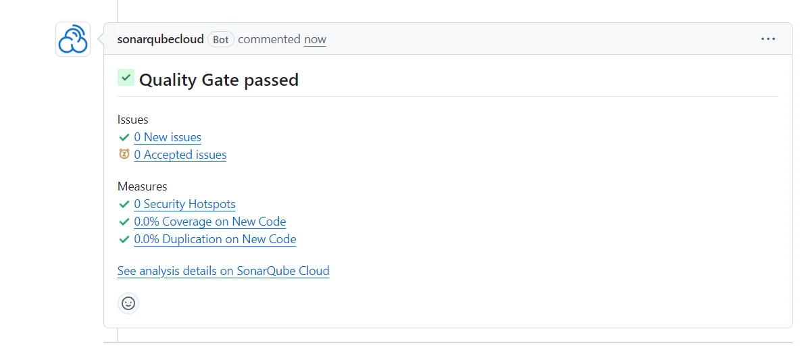
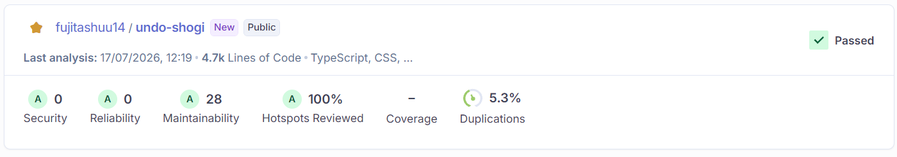

# undo-shogi

## 技術スタック

### FE: Next.js
Reactを深めたいこととNext.jsを学び始めたことが重なり、無条件でNext.jsを選定しました。

### BE: Express
Next.jsでBEも一緒に作れるのですが、以下の点が懸念されます。
* Next.js初心者にとって、BEまでまとめ上げるのはリスキー
* 慣れないAPIの書き方で、動作不能になる可能性がある

Next.js以外ではExpressかEFCoreが使えるので、どちらを選ぶかということになりました。

当初はEFCoreを考えていましたが、TSがインポートできないことを考えExpressに変更しました。

## CI等について

### GitHub Actions
品質管理として、ある程度デッドコードの検知とテストを行います。

- typeCheck
- lint
- knip
- vitest

最新コードにvitestをつけるのは必須ではありませんが、必要に応じて統合テストやロジックテストを行います。

### SonarQube
SonarQubeによる、積極的な品質管理を推奨しています。
CI組み込みではありませんが、GitHub連携を行っているため、明らかに品質を書く場合にはプルリク中にレッドがでます。

定期的に全体評価を行うことが推奨されます。
重複率5%台を一つの目安とします。

