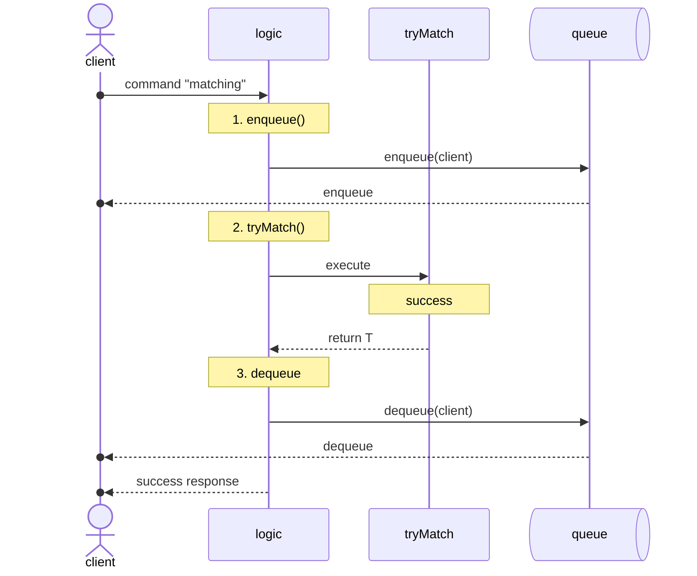
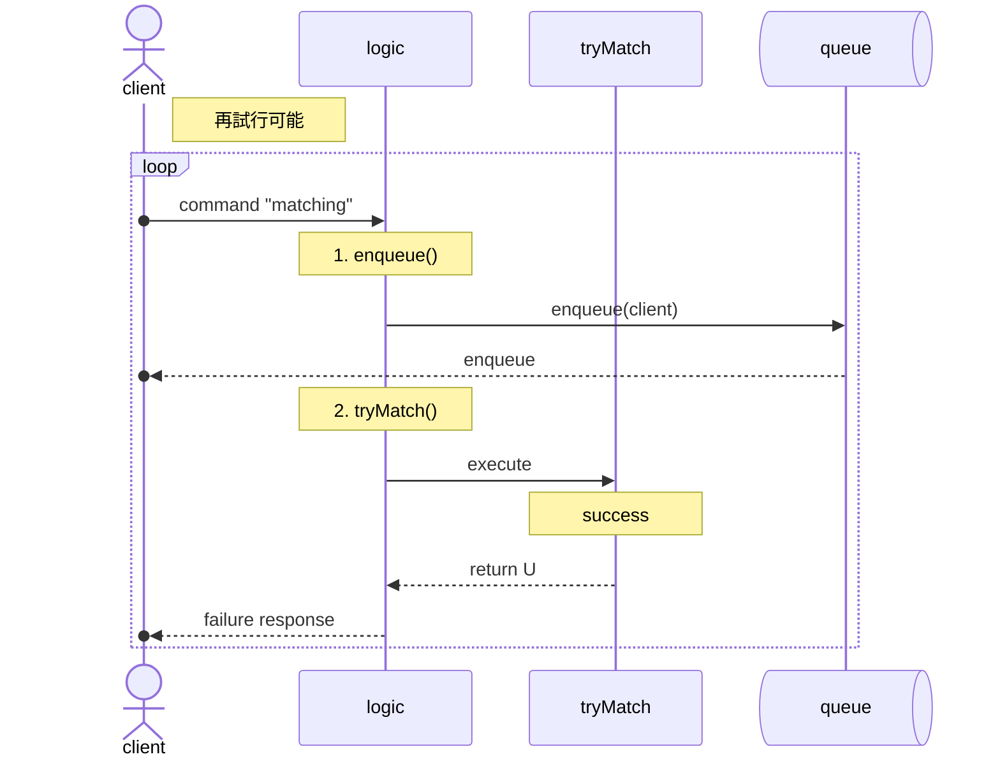
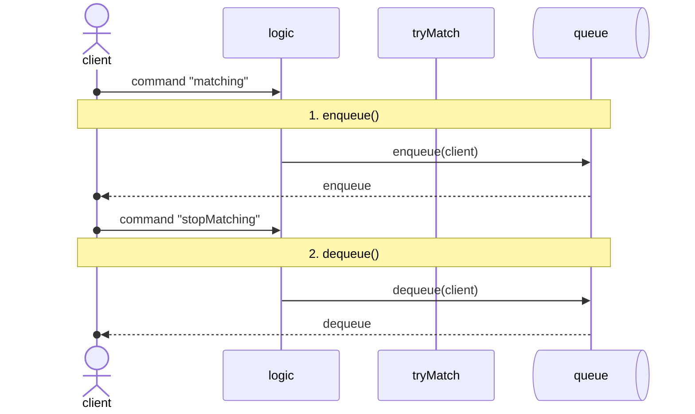

## マッチング処理のフローについて

### 1. successパターン

`success response`が返ってきたら、そこでマッチング処理は終了する。

### 2. failureパターン

failureの際に`dequeue(client)`すると、キューに一瞬しか存在しないことになりマッチングが成立しにくい。
そのため、明示的にキャンセルしない限りキューに残す。

再度コマンドを送って、自発的にマッチングする。

### 3. 打ち切りパターン

打ち切りたいときには明示的にキューから削除しなければならない。
そのため、`stopMatching`コマンドで明示的に打ち切る。

