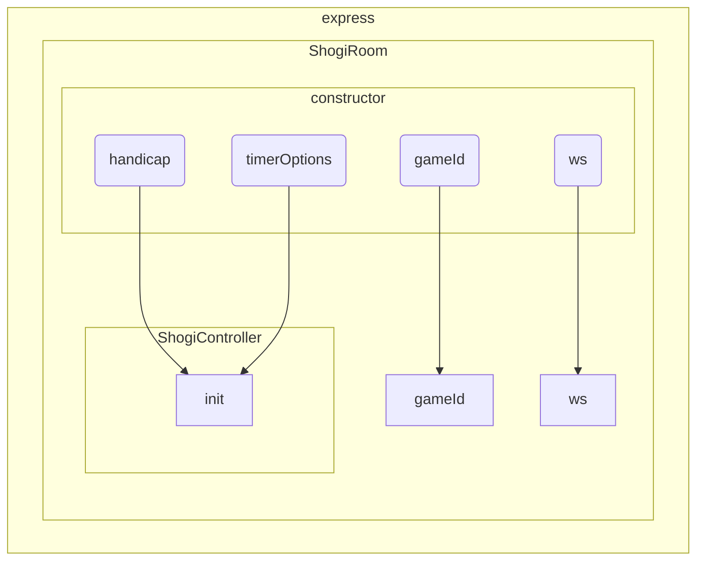

```mermaid
flowchart TD
  subgraph BE["express"]
    subgraph ShogiRoom
      subgraph shogiRoomConstructor["constructor"]
        gameId("gameId")
        handicap("handicap")
        timerOptions("timerOptions")
        ws("ws")
      end

      id["gameId"]

      WebSocket["ws"]

      subgraph ShogiController
        init
      end

      gameId --> id
      ws --> WebSocket
      handicap & timerOptions --> init
    end
  end
```
