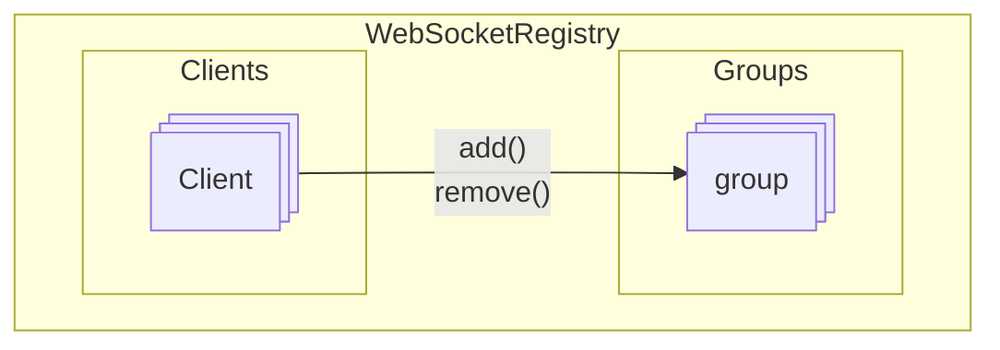
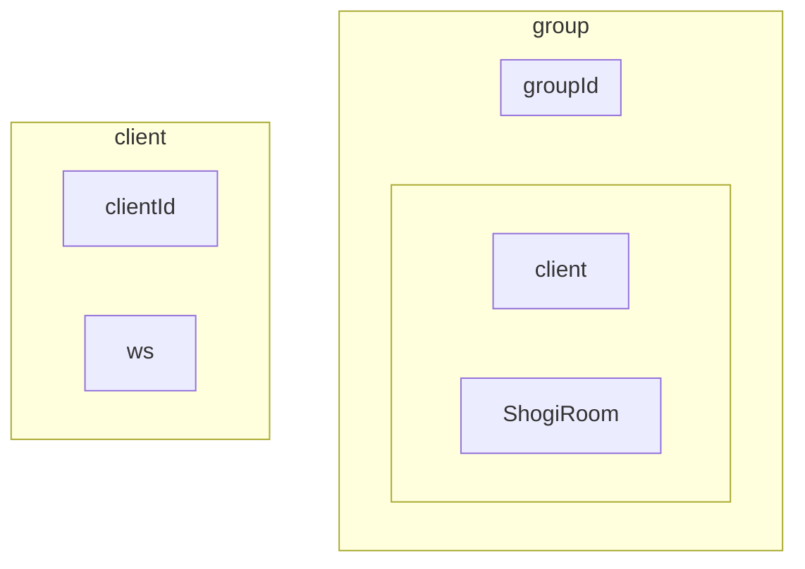
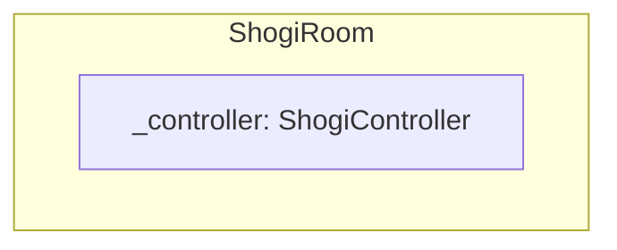

```mermaid
flowchart TD

subgraph WebSocketRegistry
  subgraph Groups
    group@{ shape: procs, label: "group" }
  end

  subgraph Clients
    client@{ shape: procs, label: "Client" }
  end


  client -->|"add()\nremove()"| group
end
```

---

```mermaid
flowchart TD

subgraph group
  subgraph obj[" "]
    direction RL

    group_client[client]
    ShogiRoom
  end

  subgraph groupId
  end
end

subgraph client
  clientId
  ws
end
```

---

```mermaid
flowchart TD

subgraph ShogiRoom
  controller["_controller: ShogiController"]
end
```
