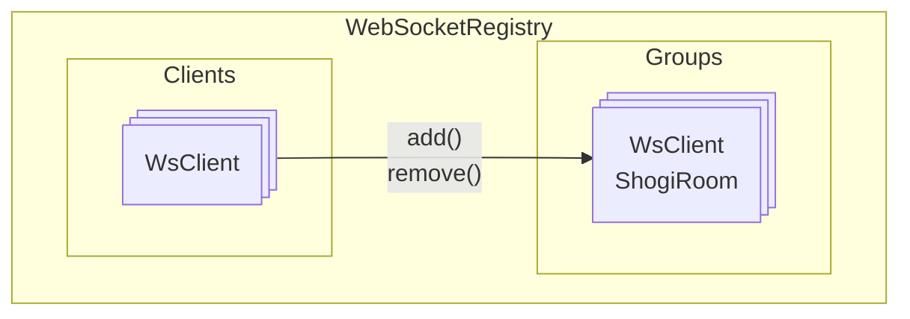
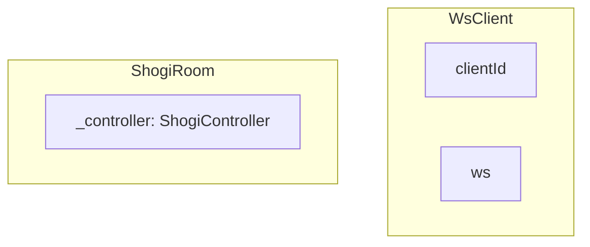

```mermaid
flowchart TD

subgraph WebSocketRegistry
  subgraph Groups
    group@{ shape: procs, label: "WsClient\nShogiRoom" }
  end

  subgraph Clients
    client@{ shape: procs, label: "WsClient" }
  end


  client -->|"add()\nremove()"| group
end
```

```mermaid
flowchart TD

subgraph WsClient
  clientId
  ws
end

subgraph ShogiRoom
  controller[_controller: ShogiController]
end
```
