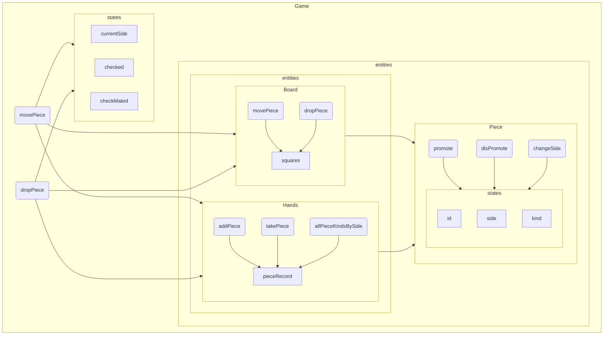

```mermaid
flowchart TD
  subgraph Piece
    direction TB
    subgraph pieceStates[states]
      id
      side
      kind
    end
    promote(promote)
    disPromote(disPromote)
    changeSide(changeSide)

    promote --> pieceStates
    disPromote --> pieceStates
    changeSide --> pieceStates
  end

  subgraph Board
    squares
    movePiece_1(movePiece)
    dropPiece_1(dropPiece)

    movePiece_1 --> squares
    dropPiece_1 --> squares
  end

  subgraph Hands
    pieceRecord
    addPiece(addPiece)
    takePiece(takePiece)
    allPieceKindsBySide(allPieceKindsBySide)

    addPiece --> pieceRecord
    takePiece --> pieceRecord
    allPieceKindsBySide --> pieceRecord
  end

  subgraph Game
    subgraph gameStateStates[states]
      direction RL
      currentSide
      checked
      checkMated
    end
    subgraph entities_1[entities]
      subgraph entities_2[entities]
        Board
        Hands
      end
      Piece

      Board --> Piece
      Hands --> Piece
    end
    movePiece_2(movePiece)
    dropPiece_2(dropPiece)

    movePiece_2 --> gameStateStates
    dropPiece_2 --> gameStateStates

    movePiece_2 & dropPiece_2 ---> Board & Hands
  end
```
