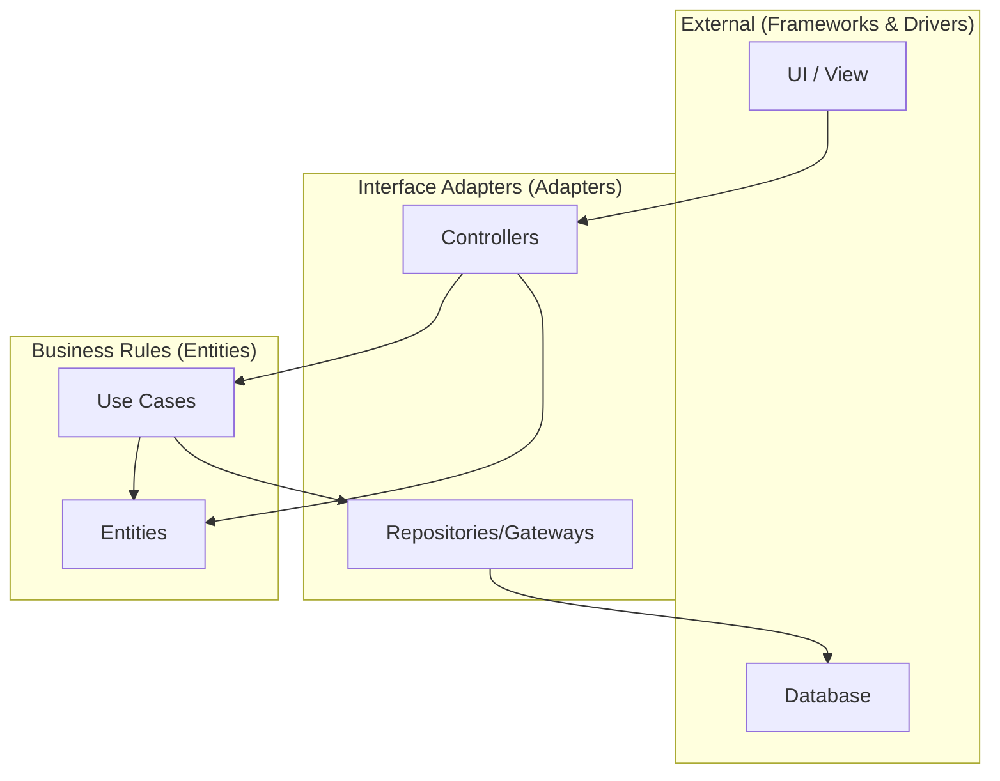

```mermaid
graph TD
  subgraph External["External (Frameworks & Drivers)"]
    UI[UI / View]
    DB[Database]
  end

  subgraph InterfaceAdapters["Interface Adapters (Adapters)"]
    Controller[Controllers]
    Gateway[Repositories/Gateways]
  end

  subgraph BusinessRules["Business Rules (Entities)"]
    UseCase[Use Cases]
    Entity[Entities]
  end


  UI --> Controller
  Controller --> UseCase

  Gateway --> DB
  UseCase --> Gateway

  UseCase --> Entity
  Controller --> Entity
```
