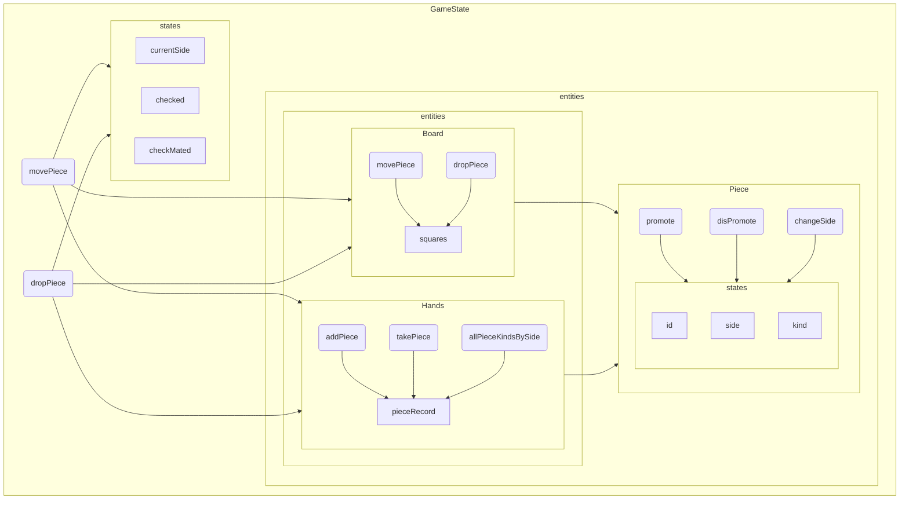

## 駒

| 駒 | コード上の定義 |
| --- | --- |
| 玉 | King |
| 金 | Gold |
| 銀 | Silver |
| 桂 | Knight |
| 香 | Lance |
| 角 | Bishop |
| 飛 | Rook |
| 歩 | Pawn |
|||
| 成り | P_Silver, P_Knight, ... |


## 盤面の動作

`gameState`には`Board`と`Hands`を注入する。



```ts
const gameState = new GameState(
  new Board(hirateSquares),
  emptyHands
);
```

## 着手

```ts
const checkmateGameState = gameState
  .movePiece({ x: 2, y: 6 }, { x: 2, y: 5 }, false)
  .movePiece({ x: 6, y: 2 }, { x: 6, y: 3 }, false)
  .movePiece({ x: 1, y: 7 }, { x: 7, y: 1 }, true)
  .movePiece({ x: 5, y: 0 }, { x: 4, y: 1 }, false)
  .dropPiece({ x: 5, y: 1 }, "Bishop")
  .movePiece({ x: 4, y: 0 }, { x: 5, y: 0 }, false)
  .movePiece({ x: 7, y: 1 }, { x: 6, y: 0 }, false)

// movePiece の第3引数は promote
```

この **着手** に沿ったKIFパーサーが必要になる

## 本プロダクトの仕様について

`gameState` は合法手と王手・詰み状態を自らチェックしている。
勝ち負け・投了・時間などは扱っておらず、盤面の整合性と動作のみ担保する。

```ts
public readonly currentSide: Side;
public readonly checked: Side | null = null;
public readonly checkMated: Side | null = null;
```


## 定義済みの事項について

以下のことは既に定義しているため、
パーサー側で定義する必要がない、または定義を合わせる必要がある。

### 駒の type 及び zodSchema
```
以下の型名で型定義されている

NormalPieceKind
NoPromotablePieceKind
PromotablePieceKind
PromotedPieceKind
PieceKind

これらの型名の後に Schema を付与したものがZodスキーマとして定義されている
```

### 座標の扱いについて

ロジックは **0インデックス法** かつ **右下が正** である。

KIF形式との差異を埋めるために以下のロジックを別に定義する。
```ts
// Position は entities でも定義されている
// Position と命名する場合は必ず混ざらないようにするか、 KifPosition と命名して衝突を避ける
export type KifPosition = {
  x: number,
  y: number
}


// boardSizeは実質的に9で固定
const boardSize = boardConfig.boardSize;

export const logicToKifPosition = (kifPos: KifPosition): Position => {
  return {
    x: boardSize - kifPos.x,
    y: kif.y - 1
  }
}

export const kifToLogicPosition = (csaPos: Position): KifPosition => {
  return {
    x: boardSize - csaPos.x,
    y: kif.y + 1
  }
}
```
