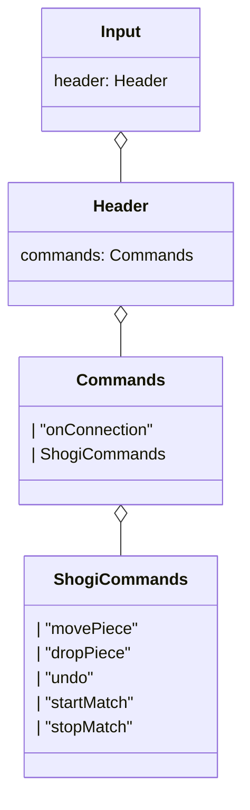
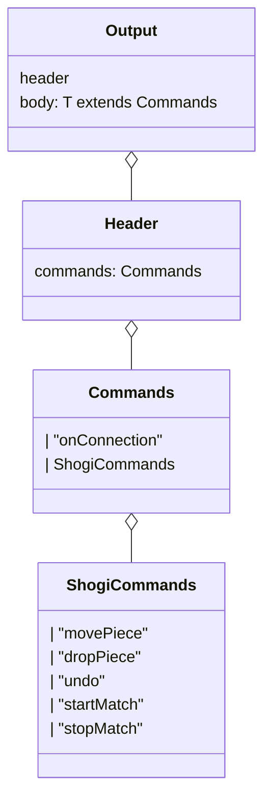

```mermaid
classDiagram

class ShogiCommands{
  | "movePiece"
  | "dropPiece"
  | "undo"
  | "startMatch"
  | "stopMatch"
}

class Commands{
  | "onConnection"
  | ShogiCommands
}

Commands o-- ShogiCommands


class Header{
  commands: Commands
}

Header o-- Commands


class Input{
  header: Header
}

Input o-- Header
```

---

```mermaid
classDiagram

class ShogiCommands{
  | "movePiece"
  | "dropPiece"
  | "undo"
  | "startMatch"
  | "stopMatch"
}

class Commands{
  | "onConnection"
  | ShogiCommands
}

Commands o-- ShogiCommands


class Header{
  commands: Commands
}

Header o-- Commands


class Output{
  header
  body: T extends Commands
}

Output o-- Header
```
