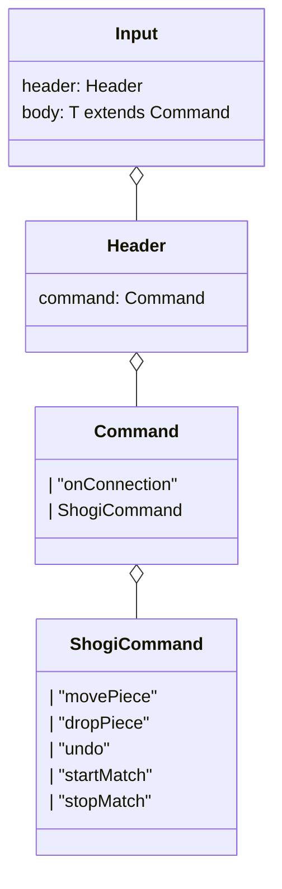
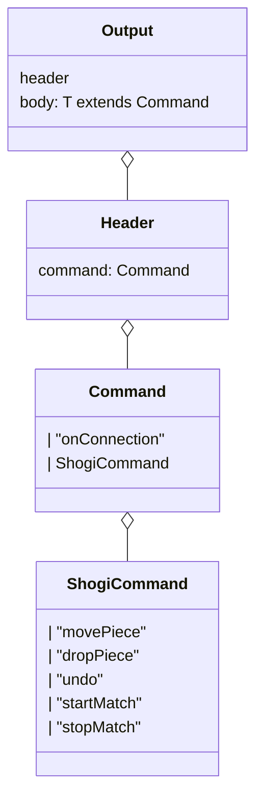

```mermaid
classDiagram

class ShogiCommand{
  | "movePiece"
  | "dropPiece"
  | "undo"
  | "startMatch"
  | "stopMatch"
}

class Command{
  | "onConnection"
  | ShogiCommand
}

Command o-- ShogiCommand


class Header{
  command: Command
}

Header o-- Command


class Input{
  header: Header
  body: T extends Command
}

Input o-- Header
```

---

```mermaid
classDiagram

class ShogiCommand{
  | "movePiece"
  | "dropPiece"
  | "undo"
  | "startMatch"
  | "stopMatch"
}

class Command{
  | "onConnection"
  | ShogiCommand
}

Command o-- ShogiCommand


class Header{
  command: Command
}

Header o-- Command


class Output{
  header
  body: T extends Command
}

Output o-- Header
```
